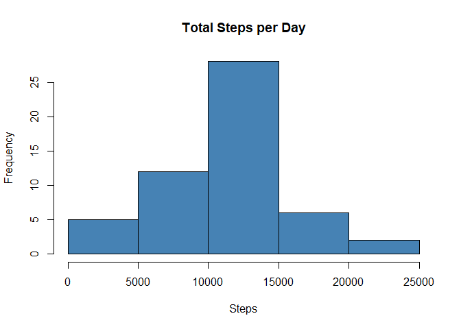
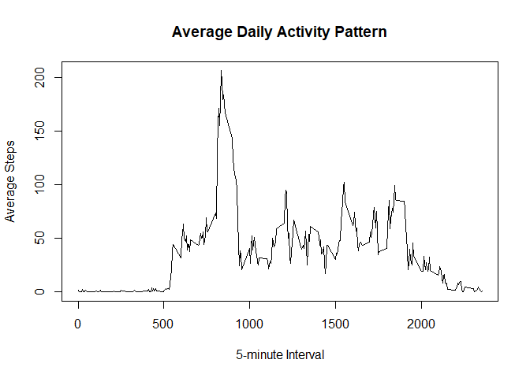
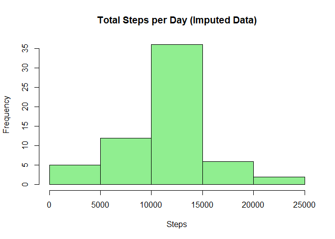
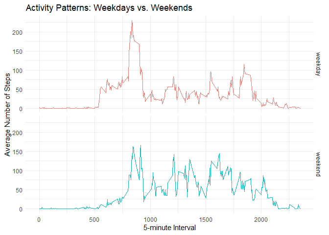

## Loading and preprocessing the data

``` r
# Unzip the file if it hasn't been unzipped yet
if (!file.exists("activity.csv")) {
  unzip("activity.zip")
}

# Load the data and format the date column
activity <- read.csv("activity.csv")
activity$date <- as.Date(activity$date, format = "%Y-%m-%d")
```

## What is mean total number of steps taken per day?

``` r
# Calculate total steps per day, ignoring missing values
steps_per_day <- aggregate(steps ~ date, data = activity, sum, na.rm = TRUE)

# Make a histogram
hist(steps_per_day$steps, main = "Total Steps per Day", xlab = "Steps", col = "steelblue")
```

<!-- -->

``` r
# Calculate and report mean and median
mean_steps <- mean(steps_per_day$steps)
median_steps <- median(steps_per_day$steps)
mean_steps
```

```
## [1] 10766.19
```

``` r
median_steps
```

```
## [1] 10765
```

## What is the average daily activity pattern?

``` r
# Calculate average steps per interval across all days
steps_per_interval <- aggregate(steps ~ interval, data = activity, mean, na.rm = TRUE)

# Make a time series plot
plot(steps_per_interval$interval, steps_per_interval$steps, type = "l", main = "Average Daily Activity Pattern", xlab = "5-minute Interval", ylab = "Average Steps")
```

<!-- -->

``` r
# Find the interval with the maximum average steps
max_interval <- steps_per_interval$interval[which.max(steps_per_interval$steps)]
max_interval
```

```
## [1] 835
```

## Imputing missing values

``` r
# Calculate total missing values
total_na <- sum(is.na(activity$steps))
total_na
```

```
## [1] 2304
```

``` r
# Strategy: Fill missing values with the mean for that specific 5-minute interval
activity_imputed <- activity
for (i in 1:nrow(activity_imputed)) {
  if (is.na(activity_imputed$steps[i])) {
    interval_val <- activity_imputed$interval[i]
    activity_imputed$steps[i] <- steps_per_interval$steps[steps_per_interval$interval == interval_val]
  }
}

# Calculate total steps per day for imputed dataset
steps_per_day_imputed <- aggregate(steps ~ date, data = activity_imputed, sum)

# Make a histogram of the imputed data
hist(steps_per_day_imputed$steps, main = "Total Steps per Day (Imputed Data)", xlab = "Steps", col = "lightgreen")
```

<!-- -->

``` r
# Calculate new mean and median
mean_imputed <- mean(steps_per_day_imputed$steps)
median_imputed <- median(steps_per_day_imputed$steps)
mean_imputed
```

```
## [1] 10766.19
```

``` r
median_imputed
```

```
## [1] 10766.19
```
**Impact of imputing missing data:** By using the interval means to fill missing values, the overall mean remains exactly the same. However, the median shifted slightly and is now perfectly equal to the mean. Imputing the data increased the peak of the histogram since the days that previously consisted entirely of `NA` values now contain the average daily step count.

## Are there differences in activity patterns between weekdays and weekends?

``` r
library(ggplot2)

# Create a new factor variable for weekday/weekend
activity_imputed$day_type <- ifelse(weekdays(activity_imputed$date) %in% c("Saturday", "Sunday"), "weekend", "weekday")
activity_imputed$day_type <- as.factor(activity_imputed$day_type)

# Aggregate average steps by interval and day type
pattern_by_day_type <- aggregate(steps ~ interval + day_type, data = activity_imputed, mean)

# Make a panel plot
ggplot(pattern_by_day_type, aes(x = interval, y = steps, color = day_type)) +
  geom_line() +
  facet_grid(day_type ~ .) +
  labs(title = "Activity Patterns: Weekdays vs. Weekends", x = "5-minute Interval", y = "Average Number of Steps") +
  theme_minimal() +
  theme(legend.position = "none")
```

<!-- -->
